# Evaluation Metrics of Recommendation System

### Recommendation System

Recommendation System or RecSys is a platform or a way where someone get a relevant item or products based on their past interactions(liked, bought, wishlist, etc)

### Measure Success of RecSys

1. Offline Metrics
2. Online Metrics

## Ofline Metrics

In this, we evaluate on the past data(doesn't require real time interactions.)

1. Visual Inspection
2. Completeness on k (recall@k)
3. Accuracy on k(precision@k)
4. Rank Aware Metrics  
   i. Mean Reciprocal Rank(MRR)  
   ii. Mean Average Precision (mAP)  
   iii. Normalized Discounted Cumulative Value(nDCG)

## 1. Visual Inspection

Visual inspection is more than just glancing at recommendation outputs; it's about deciphering the story they tell. Imagine a scenario where a food recommendation system is at play. Picture a user greeted by recommendations at the crack of dawn. What should they see? Perhaps a spread of bread and pastries, vibrant fruits, refreshing salads, and steaming cups of coffee or tea. Now, consider the jarring sight of pizza and beer in the early hours – a clear mismatch with the user's morning appetite. Visual inspection helps to spot such discrepancies, offering if recommendations ailgn with business objectives or not.

## 2. Recall@k (Completeness on k)

### What is 'k'?

'k' represents number of recommendations considered while evaluation. If k=10, then we look at the top 10 recommendations.

Measures the ratio of the number of relevant items in the first k ranked items to the total number of relevant elements.

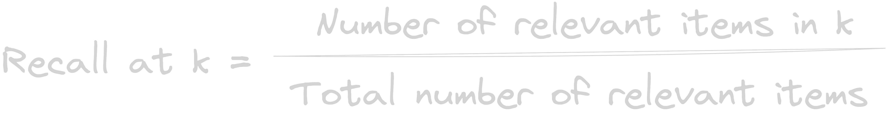

### Example

Consider the number of relevants for a particular for user/query = 8  
recall@10 = number of relevant items present in the top 10 / total number of relevant items

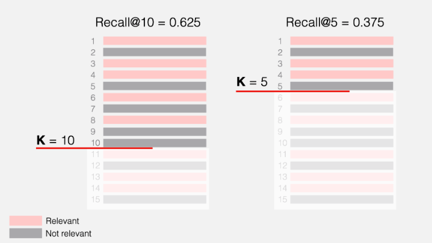

Recall@10 = 5/8 = 0.625  
Recall@8 = 5/8 = 0.625  
Recall@5 = 3/8 = 0.375

### Cons

- If the total number of relevant items is greater than k, we cannot reach the perfect recall. Ex: if for a user the relevant items is 20, if we calculate recall@10, and even if all the recommendations in the top 10 are relevant, we’ll be at most 50%. Also, varying numbers of relevant items across users/query is another issue, which leads to variabiilty to recall.
- Doesnot consider ranks. (no-rank awareness)
- What if the we couldn’t define the true relevant items for users/query.

## 3. Precision@k (Accuracy on k)

Measures out of k ranked items, how many of them are actually relevant.

### Example

precision@10 = number of relevant items in top 10 / number of items in top 10

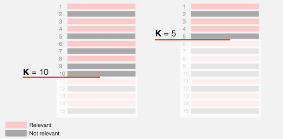

precision@10 = 5/10 = 0.5  
precision@5 = 3/5 = 0.6

### Cons

- No rank awareness.  
  Example:

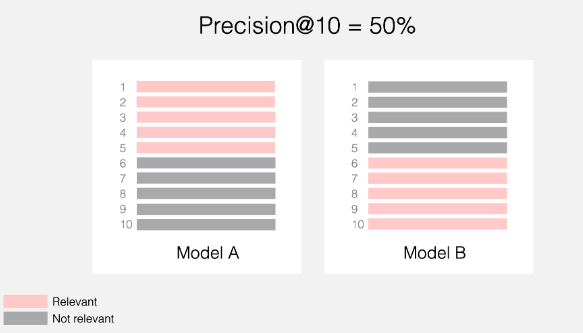

In both cases, precision@10 will be 50%, though for model B the relevant items are at the very bottom of the list.

So, to consider rank, rank aware evalualtion metrics like MRR, nDCG or mAP would be a great choice.

- what if the relevant items(for e.g., 3) in the dataset is smaller than k(10). Then, even if the system can find them all and correctly place them at the top of the list, precision@10 = 30%

## 4. Rank Aware Metrics

Consider the position of items while evaluating

## i. Mean Reciprocal Rank(MRR)

Takes the rank of the first relevant elements in the ranked list  
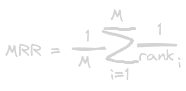

where,

m = number of users(recommendation) or total number of ranked lists for a query or user in a evaluation dataset

rank i =rank of the first relevant element in the ith ranked list

#### Example

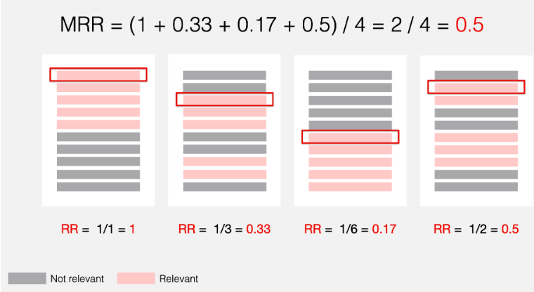

Here is how we compute the Reciprocal Rank (RR) for each user/query:

- For user 1, the first relevant item is in position 1, so the RR is 1.
- For user 2, the first relevant item is in position 3, so the RR is 1/3 ≈ 0.33.
- For user 3, the first relevant item is in position 6, so the RR is 1/6 ≈ 0.17.
- For user 4, the first relevant item is in position 2, so the RR is 1/2 = 0.5.

Then, the resulting Mean Reciprocal Rank is: (1+0.33+0.17+0.5)/4 = 2/4 = 0.5

Similarly for, MRR@K, we’ll only consider the top k(5) ranks.

MRR@5 = (1 + 0.33 + 0 + 0.5) / 4 ≈ 0.45

### Interpretation

MRR can take values from 0 to 1.

- MRR equals 1 when the first recommendation is always relevant.
- MRR equals 0 when there are no relevant recommendations in top-K.
- MRR can be between 0 and 1 in all other cases. The higher the MRR, the better.

### Cons

- Disregards the ranks after the first relevant item.
- Handles only the binary relevance.

## ii. mAP (Mean Average Precision)
Measures the average precision at all relevant ranks within the list of top k recommendations.

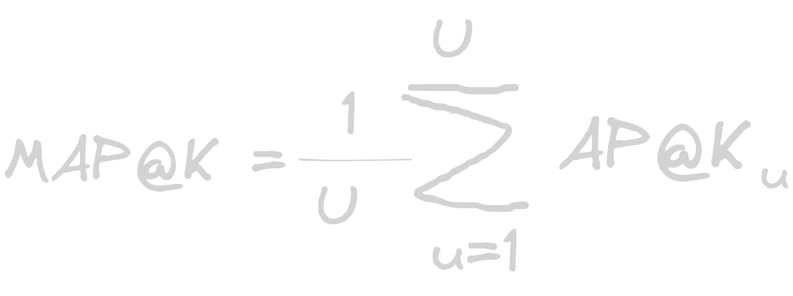

### Example
Lets say below is the top 6 relevant items for a particular user.  
**Note:**
Gray color: Not relevant
Pink: Relevant 

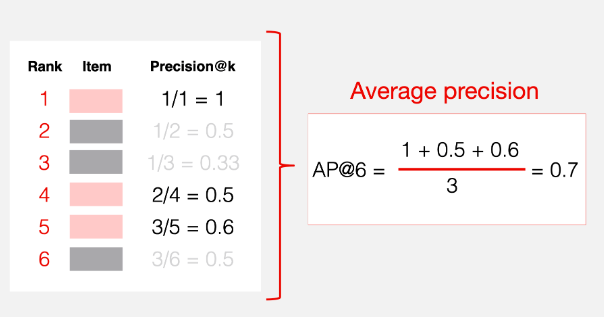

- First we calculate precision at each rank of the top k true relevant items
- Then, take average of these precision.
- The, compute 1 and 2 for all the users/query, and take average which results to mAP@k for all users/query.

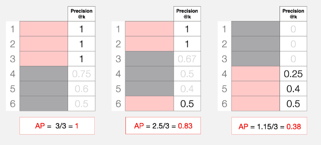

### Interpretation

- MAP equals 1 in the case of perfect ranking when all relevant documents or items are at the top of the list.
- MAP equals 0 when no relevant objects are retrieved.
- MAP can be between 0 and 1 in all other cases. The closer the MAP score is to 1, the better the ranking performance.

## nDCG(Normalized Discounted Cumulative Gain)
Metric that compares the rankings to an ideal ranking(where all relevant items are at the top of the list).

We assume that there is some ideal ranking with all the items sorted in decreasing order of relevance. For example, for a user/query, below is the ideal ranking for them.

### Formula  
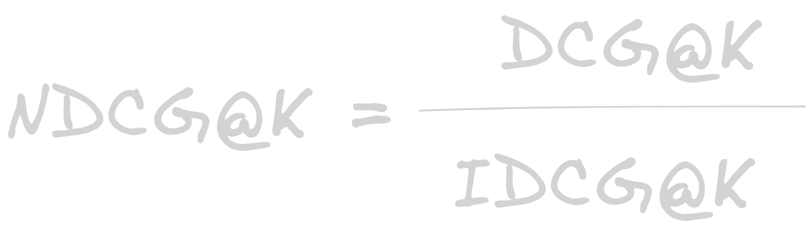

Before moving DCG, let's understand what cumulative gain really is?

###  Cumulative Gain

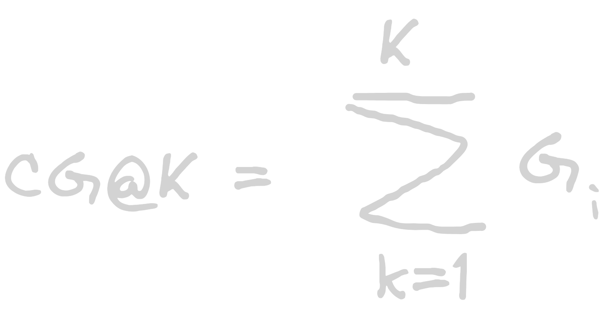

#### Example

Let's consider we have 5 recommendations for two different cases, 
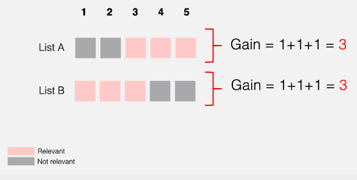

In above case, both list has same cumulative gain. 
But for list A, the relevant items are at the bottom of the ranked list but still both are considered to be a good recommendation from cumulative gain perspective. If we can penalize, the relevant results at the lower rank, then it would be a fair approach. 

### Discounted Cumulative Gain(DCG)
It introduces logarithmic discount that helps to assigns less weight to releant items that appear lower. This way, instead of simply summing up the item’s relevance, we adjust the contribution of each item based on its position. 

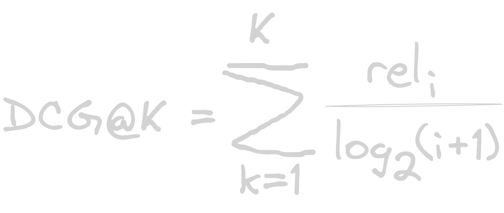
Where rel (i) is the relevance score of the item at position i.

#### Example
if for the particular user/query, recommendation list is [1, 0, 1,  0, 1].  
1= relevant  
0 = non-relevant 

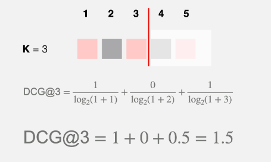

If the ranked LIst was [1, 1, 0, 0, 1] calculate DCG@3?

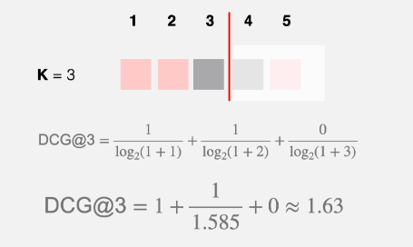

Since, the relevant item was one rank higer than previous, so the DCG was increased.

IDCG Can be calculated as same as DCG

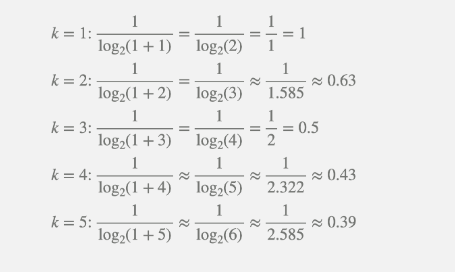

### Interpretations

NDCG can take values from 0 to 1.

- NDCG equals 1 in the case of ideal ranking when items are perfectly sorted by relevance.
- NDCG equals 0 when there are no relevant objects in top-K.
- NDCG can be between 0 and 1 in all other cases. The higher the NDCG, the better.

### Pros

- Rank-aware metric
- Handles both binary and numeral scores.  (Unlike mAP or MRR only handle binary inputs)
- Normalized metric.
  

## Reference  

[Evaluating RecSys - Evidently](https://www.evidentlyai.com/ranking-metrics/evaluating-recommender-systems)

